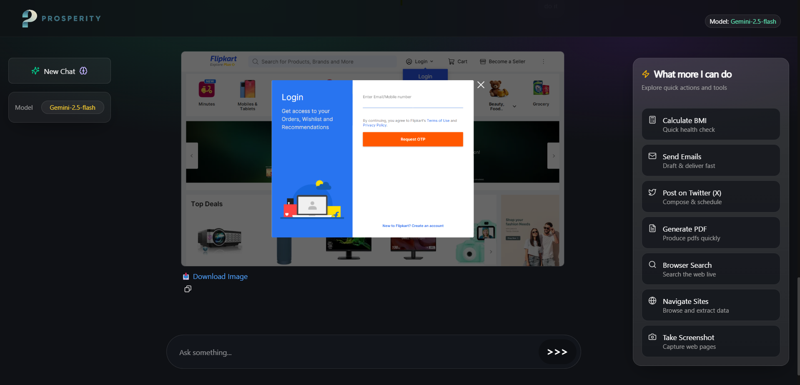
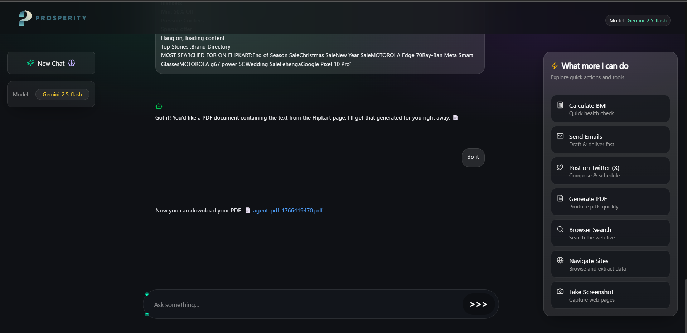
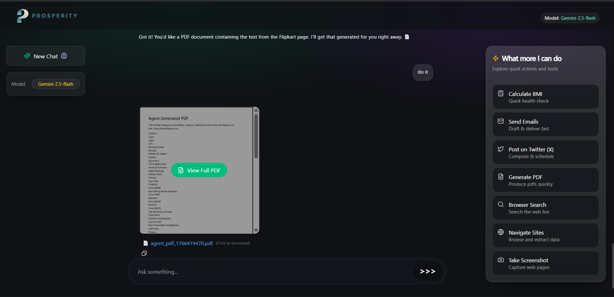
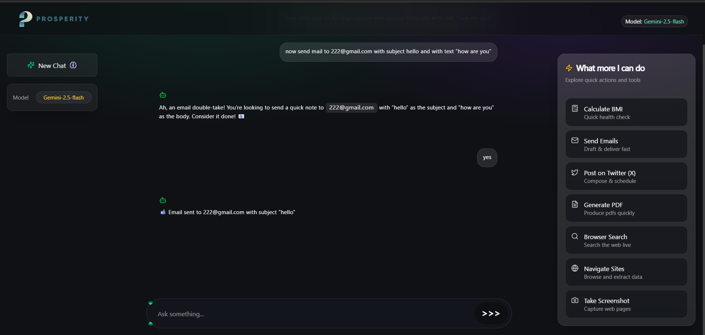

# Prosperity Agent 🤖 - Advanced AI Workspace


Prosperity Agent is a powerful, unified AI assistant built with the MERN stack architecture. It features a **multi-provider AI system** with **OpenAI o3-mini** as the primary model and **Google Gemini 2.5 Flash** as fallback, leveraging the **Model Context Protocol (MCP)** for seamless tool integration.

This isn't just a chatbot — it's a complete AI workspace that integrates browser automation, email delivery, social media posting, document generation, Google productivity tools, and full **GitHub/Git workspace management** into a sleek, premium interface.

---

## 🚀 Key Features

### 🧠 Multi-Provider AI System
Intelligent fallback system ensures 99.9% uptime:
- **Primary:** OpenAI o3-mini - Advanced reasoning and complex task execution
- **Fallback:** Google Gemini 2.5 Flash - Seamless backup when needed
- **Auto-Switching:** Transparent provider failover with zero user intervention

### 🌐 Playwright Browser Automation
The agent can interact with the live web using Playwright:
- **Live Search:** Perform real-time Google searches for up-to-date information
- **Web Navigation:** Navigate to any URL and extract page content
- **Screenshots:** Capture full-page screenshots of websites
- **Interactive Actions:** Click, type, press keys, and automate complex workflows



### 🚀 GitHub & Git Assistant
Seamlessly manage your codebase and remote repositories directly from the chat:
- **Local Git Control:** Check status, stage changes, commit with AI-generated messages, and push to remote
- **GitHub Intelligence:** Create issues, list pull requests, and analyze repository statistics/stars
- **Profile Insights:** Fetch information about any GitHub user or organization instantly

### 📅 Google Workspace Integration
Full integration with Google productivity tools:
- **Google Calendar:** Add events, view daily schedules, check availability
- **Google Keep:** Create, update, archive, delete, and list notes
- **Seamless Sync:** All changes reflect in your actual Google accounts

### 📄 Document & PDF Intelligence
- **PDF Generation:** Instantly convert text or web data into professionally formatted PDF documents
- **Smart Previews:** View generated PDFs directly within the chat interface using the built-in PDF viewer
- **Resource Linking:** Download links are provided for every generated file

<p align="center">
  
  
</p>

### 📧 Communication & Socials
- **Direct Emailing:** Send emails via Gmail integration with custom subjects and bodies
- **Twitter (X) Integration:** Post updates directly to your X account through the AI



### 💻 Local File System Operations
- **Project Analysis:** Read and analyze any folder or file on your system
- **Code Refactoring:** Apply suggested improvements directly to your code files
- **File Management:** List directories, read contents, and update files

### 📺 YouTube & Article Summarizer
Save hours of reading and watching with intelligent summarization:
- **YouTube Transcripts:** Fetch full video transcripts automatically
- **Article Extraction:** Extract main content from any webpage, removing clutter
- **Key Takeaways:** Get the 5 most important points from any content
- **Smart Analysis:** Works with YouTube URLs, article links, or raw text

### 🖼️ Interactive Media Handling
- **Full-Screen Previews:** Click any screenshot or image to view it in a premium full-screen modal
- **Image Downloads:** Quick download links for all visual assets generated during the session

---

## 🛠️ Installation & Setup

### Prerequisites
- Node.js (v18+)
- Python 3.x (for PDF generation and specialized tools)
- API Keys: OpenAI, Google Gemini, GitHub Token, Twitter (X) API, Gmail App Password

### 1. Clone the Repository
```bash
git clone https://github.com/Mohhit6075/AI-Agent.git
cd AI-Agent
```

### 2. Backend Setup
1. Navigate to the backend directory:
   ```bash
   cd backend
   ```
2. Install dependencies:
   ```bash
   npm install
   ```
3. Create a `.env` file and add your credentials:
   ```env
   # AI Providers (Primary → Fallback)
   OPENAI_API_KEY=your_openai_key
   OPENAI_MODEL=o3-mini
   GEMINI_API_KEY=your_gemini_key
   GEMINI_MODEL=gemini-2.5-flash-lite
   
   # GitHub Integration
   GITHUB_TOKEN=your_personal_access_token
   
   # Google Calendar API
   GOOGLE_CLIENT_ID=your_client_id
   GOOGLE_CLIENT_SECRET=your_client_secret
   GOOGLE_REFRESH_TOKEN=your_refresh_token
   
   # Google Keep API
   KEEP_EMAIL=your_email@gmail.com
   KEEP_PASSWORD=your_app_password
   
   # Social & Communication
   TWITTER_API_KEY=your_x_api_key
   TWITTER_API_SECRET=your_x_api_secret
   TWITTER_ACCESS_TOKEN=your_access_token
   TWITTER_ACCESS_TOKEN_SECRET=your_token_secret
   TWITTER_CLIENT_ID=your_client_id
   TWITTER_CLIENT_SECRET=your_client_secret
   HOST_EMAIL=your_gmail@gmail.com
   HOST_PASSWORD=your_app_password
   
   # Server Config
   FRONTEND_URL=http://localhost:5173
   ```
4. Start the server:
   ```bash
   npm run dev  # or npx nodemon
   ```

### 3. Frontend Setup
1. Navigate to the frontend directory:
   ```bash
   cd frontend
   ```
2. Install dependencies:
   ```bash
   npm install
   ```
3. Start the development server:
   ```bash
   npm run dev
   ```

---

## 📂 Project Structure

```
AI-Agent/
├── frontend/                 # React + Vite application
│   ├── src/
│   │   ├── components/
│   │   │   ├── Home/        # Main chat interface
│   │   │   ├── Drawer/      # Sidebar navigation
│   │   │   ├── About.jsx    # About page with features
│   │   │   └── Preloader.jsx
│   │   ├── App.jsx
│   │   └── index.css
│   └── public/
├── backend/                  # Express + MCP Server
│   ├── index.js             # Main server with multi-provider AI
│   ├── mcp.tool.js          # Tool implementations
│   ├── tools/
│   │   ├── browserTools.js  # Playwright automation
│   │   ├── github_tools.js  # Git & GitHub operations
│   │   ├── google/          # Calendar & Keep APIs
│   │   ├── email.js         # Gmail integration
│   │   ├── twitterPost.js   # X/Twitter posting
│   │   ├── generatePdf.js   # PDF generation
│   │   └── contentSummarizer.js  # YouTube & Article tools
│   └── Python/              # Helper scripts
└── README.md
```

---

## 🔧 Available Tools (36+)

| Category | Tools |
|----------|-------|
| **Browser Automation** | `browserNavigate`, `browserSearch`, `browserScreenshot`, `browserClick`, `browserType`, `browserPressKey`, `browserWaitFor` |
| **Git & GitHub** | `gitCheckStatus`, `gitListCommits`, `gitCommitAll`, `gitPush`, `githubCreateIssue`, `githubListIssues`, `githubListPullRequests`, `githubCreatePullRequest`, `githubGetRepoStats`, `githubGetUserProfile` |
| **Google Calendar** | `calendarListEvents`, `calendarAddEvent`, `calendarViewDay` |
| **Google Keep** | `keepListNotes`, `keepCreateNote`, `keepUpdateNote`, `keepArchiveNote`, `keepDeleteNote` |
| **File System** | `listProjectFiles`, `readProjectFile`, `updateCodeSnippet` |
| **Communication** | `sendEmail`, `createPost` (Twitter/X) |
| **Documents** | `givemePDF`, `editPDF` |
| **Content Summarizer** | `youtubeGetTranscript`, `articleSummarize`, `extractKeyPoints` |

---

## 🧪 How it Works

1. **User input** is sent to the backend proxy
2. **OpenAI o3-mini** (primary) or **Gemini 2.5 Flash** (fallback) analyzes the request
3. The AI decides if "tools" (MCP) are needed for the task
4. The **MCP Client** triggers the appropriate tool (e.g., Playwright, Git, Calendar)
5. Tool results are processed and sent back to the **Frontend** for rich rendering

```
┌─────────────┐     ┌──────────────────┐     ┌─────────────┐
│   Frontend  │────▶│   Backend Proxy  │────▶│  OpenAI API │
│   (React)   │◀────│   (Express+MCP)  │     └─────────────┘
└─────────────┘     │                  │            │
                    │   ┌──────────┐   │      (fallback)
                    │   │  Tools   │   │            ▼
                    │   └──────────┘   │     ┌─────────────┐
                    └──────────────────┘     │ Gemini API  │
                                             └─────────────┘
```

---

## 🎨 UI Features

- **Premium Dark Theme:** Sleek, modern interface with glassmorphism effects
- **Animated Preloader:** Custom mathematical animations on startup
- **Responsive Design:** Works seamlessly on desktop and mobile
- **Interactive PDF Viewer:** Built-in document preview with download options
- **Image Modal:** Full-screen image viewing with blur backdrop
- **Message Selection:** Multi-select messages for batch deletion
- **Real-time Status:** Live AI provider status indicator

---

## 📜 License

This project is for educational purposes. Built by [Mohhit1230](https://github.com/Mohhit1230).

---

## 🤝 Contributing

Contributions are welcome! Feel free to:
- Report bugs
- Suggest new features
- Submit pull requests

---

<div align="center">
  <strong>⚡ Prosperity Agent - Your Unified AI Workspace ⚡</strong>
  <br/>
  <sub>Powered by OpenAI o3-mini + Google Gemini 2.5 Flash</sub>
</div>
